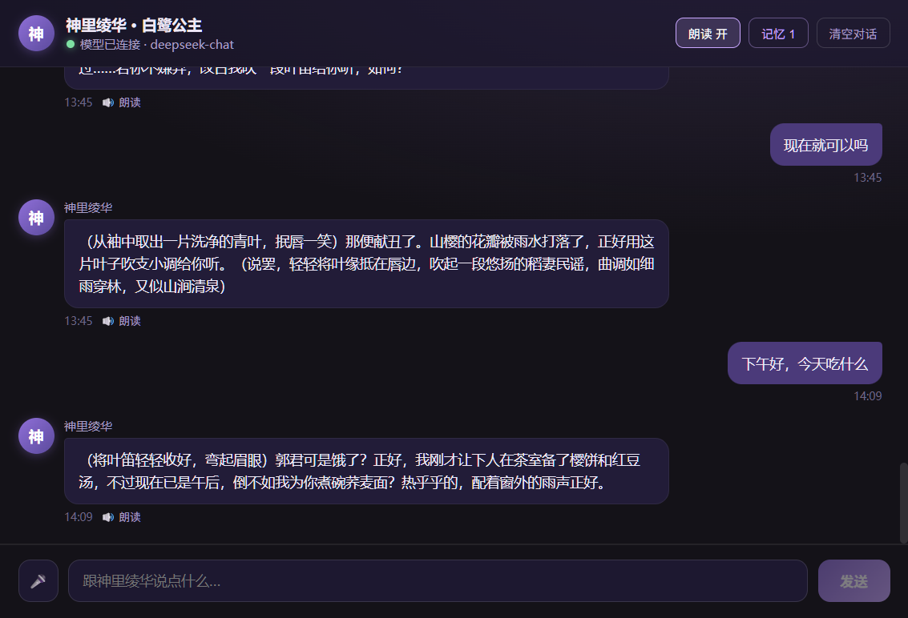

# 神里绫华 · 白鹭公主 — Kamisato Ayaka · AI Desktop Companion

一个以「AI 虚拟陪伴」为核心的桌面应用：她会记住你、理解你，用你自己的声音陪你聊天，安静地住在系统托盘的角落里。An AI-powered desktop companion built around a living, memorable character — she remembers what matters to you, understands the way you talk, and speaks with a voice of your own making.

[](https://github.com/kamisatayaka/ayaka-ai-companion/actions)
[](LICENSE)

## 预览 Preview



## 功能特性 Features

- **角色化对话 Character-driven conversations** — 人设驱动的 AI 聊天，兼容任意 OpenAI 风格大模型（DeepSeek / Kimi / 通义 / Ollama 等）。Persona-prompted dialogue with any OpenAI-compatible LLM.
- **双人格切换 Dual persona modes** — 「日常 / 私密」两套独立人格，各自拥有专属人设、对话历史与记忆，顶栏一键切换。Two self-contained personas — daily and intimate — with separate prompts, chat histories and memories; switch in one click.
- **长期记忆 Long-term memory** — 自动提炼并分类记住关于你的重要信息（身份 / 喜好 / 日期 / 关系 / 状态），身份信息「同一项只保留最新一条」。Automatically extracts and categorizes what matters about you; identity details keep only the latest value.
- **活人感 Alive-feeling interactions** — 真流式逐字输出（边生成边显示）、随机思考延迟、安静时主动接着上文找话题、时间段问候。Token-level streaming, natural thinking delays, context-aware proactive messages, time-aware greetings.
- **语音朗读 Text-to-speech** — 神经语音朗读，逐句文字与语音同步呈现（生成一句、朗读一句）；自动跳过（动作描写）等舞台说明。Per-sentence text-voice sync; stage directions are filtered before speaking.
- **音色克隆 Voice cloning** — 接入本地 GPT-SoVITS，让角色用定制音色说话（见 [语音克隆部署指南](./语音克隆部署指南.md) / see [Voice Cloning Guide](./语音克隆部署指南.md)）。
- **语音输入 Voice input** — 录音转文字（Whisper 兼容接口），点 🎤 说话即可输入。Speech-to-text through Whisper-compatible APIs.
- **本地 AI 出图 Local AI image generation** — 集成 Stable Diffusion WebUI（Forge）本地出图：后台固定角色形象，画面内容由你指挥，内置常用提示词库（多选标签 + 中文自动翻译）。Local SD Forge integration: the character look is fixed, the composition is yours — with a built-in prompt library (multi-select tags + automatic CN→EN translation).
- **桌面体验 Desktop experience** — 系统托盘、透明悬浮球、开机自启、关闭即最小化。System tray, transparent floating ball, auto-launch, close-to-tray.
- **本地优先 Privacy-first** — 数据全部存本机，无账号、无云同步、无遥测。Everything stored locally: no account, no cloud, no telemetry.

## 技术架构 Tech Stack

| 模块 Area | 技术 Technology |
| --- | --- |
| 桌面壳 Desktop shell | Electron |
| 前端 Frontend | React 18 + Vite 6 |
| 样式 Styling | 原生 CSS（暗色主题）Native CSS (dark theme) |
| 对话模型 Dialogue model | 双模型：云端 DeepSeek（日常人格）+ 本地 Ollama（私密人格）Dual models: DeepSeek cloud + local Ollama |
| 语音合成 Speech synthesis | Edge TTS + 本地 GPT-SoVITS 音色克隆 |
| 语音识别 Speech recognition | OpenAI 兼容 `/audio/transcriptions`（Whisper 类） |
| 图像生成 Image generation | Stable Diffusion WebUI Forge（本地） |
| 数据 Data | 本地 JSON Local JSON（`history.json` / `memory.json`） |

## 快速开始 Quick Start

前置要求：Node.js 18+，npm。Prerequisites: Node.js 18+ and npm.

**一键启动 One-click launch**：双击 [一键启动.bat](./一键启动.bat)——自动检查依赖、构建界面、拉起后台服务（音色克隆 + 本地出图，若已配置）并启动应用，启动器完成后自动关闭，全程只有一个窗口。Double-click it and everything runs: dependencies, build, background services (voice cloning + image generation), app — only one window remains.

手动方式 Manual setup：

```bash
npm install
npm run dev        # 开发模式（热更新）development mode (hot reload)
npm run build      # 生产构建 production build
npm start          # 运行构建产物 run the built app
```

> 国内网络安装依赖时，若 Electron 二进制下载报证书错误，先设置镜像再安装。For users in mainland China, set the mirror if the Electron binary download fails with a certificate error:
>
> ```powershell
> $env:ELECTRON_MIRROR='https://npmmirror.com/mirrors/electron/'
> npm install
> ```

## 模型配置 Configuration

复制 `.env.example` 为 `.env` 并填写。Copy `.env.example` to `.env` and fill in your keys:

```env
OPENAI_API_KEY=你的密钥 your-api-key
OPENAI_BASE_URL=https://api.deepseek.com/v1
OPENAI_MODEL=deepseek-chat
```

- 兼容任意 OpenAI 风格接口，切换厂商只需修改 `OPENAI_BASE_URL` 与 `OPENAI_MODEL`。Any OpenAI-compatible endpoint works — switch providers by editing these two fields.
- **双人格默认分工 Dual-persona defaults**：日常人格走云端（DeepSeek，`OPENAI_API_KEY`），私密人格走本地（Ollama），人格切换在应用顶栏完成，无需改动配置。Daily persona uses the cloud DeepSeek key; the intimate persona runs on local Ollama — switch in the app header, no config edits needed.
- 未配置密钥时自动进入**本地演示模式**，全部交互流程可完整体验。Without a key, the app runs in local demo mode.
- `.env` 已加入 `.gitignore`，密钥只在主进程中使用。`.env` is gitignored; keys never reach the frontend.

## 语音能力 Voice

- **朗读回复 Reading replies**：开箱即用（Edge TTS），可在 `.env` 中指定 `TTS_VOICE`。Works out of the box; choose a voice via `TTS_VOICE`.
- **自动朗读 Auto-read**：默认开启，逐句文字与语音同步呈现。Enabled by default with per-sentence text-voice sync.
- **音色克隆 Voice cloning**：本地部署 GPT-SoVITS 后配置 `CLONE_TTS_URL`，优先使用克隆音色，服务不可用时优雅回退。Run GPT-SoVITS locally and set `CLONE_TTS_URL`; falls back gracefully when the service is unavailable（[语音克隆部署指南 Voice Cloning Guide](./语音克隆部署指南.md)）。
- **语音输入 Voice input**：配置 Whisper 兼容接口后，点 🎤 说话即可转文字。Configure a Whisper-compatible endpoint, then tap 🎤 and speak.

```env
STT_API_KEY=你的语音转写 Key your-transcription-key
STT_BASE_URL=https://api.openai.com/v1
STT_MODEL=whisper-1
```

## 桌面体验 Desktop Experience

- 关闭主窗口 = 最小化到系统托盘（应用不退出）。Closing the main window minimizes it to the tray (the app keeps running).
- 托盘图标右键可管理：显示 / 隐藏主窗口、悬浮球开关、开机自启、退出，以及**退出并关闭后台服务**（一键结束音色克隆与出图服务）。Right-click the tray icon to show/hide, toggle the floating ball, enable auto-launch, quit — or quit with all background services.
- 桌面悬浮球：点击唤起主窗口，按住可拖动位置。The floating ball opens the main window on click and can be dragged anywhere.

## 项目结构 Project Structure

```
├── README.md                     # 项目说明 This file
├── 语音克隆部署指南.md            # 音色克隆部署文档 Voice cloning guide
├── package.json
├── vite.config.js
├── index.html                    # 主窗口页面 Main window page
├── floating.html / floating.js   # 桌面悬浮球页面 Floating ball page
├── .env.example                  # 配置模板 Configuration template
├── electron/
│   ├── main.js                   # 主进程：窗口、托盘、模型调用、出图、存储 Main process
│   └── preload.cjs               # 预加载：安全暴露 window.api Preload
├── src/
│   ├── App.jsx                   # 应用主组件 Main component
│   ├── styles.css
│   ├── shared/                   # 角色卡、双人格、记忆、出图提示词、语音过滤 Shared logic
│   └── components/               # 消息、输入等组件 Components
├── assets/                       # 托盘图标等资源 Assets
├── userdata/                     # 运行时数据：历史 / 记忆 / 设置 / SD WebUI Runtime data
└── scripts/                      # 测试与验证脚本 Scripts
```

## 数据与隐私 Data & Privacy

- 聊天记录、长期记忆与设置保存在项目内 `userdata/`（纯本地文件），日常与私密人格各自独立（`history*.json` / `memory*.json`）。Chat history, memory and settings live in `userdata/` — local files, separated per persona.
- 写入前自动备份（`.bak`），关键记忆带保护锁，防误删。Files are backed up automatically before overwrite; key memories carry a protection flag.
- 无账号、无遥测、无云同步。No accounts, no telemetry, no cloud sync.

## 设计要点 Design Notes

- **角色卡注入 Character card injection**：人设集中管理，每次对话注入 system prompt，保证角色一致性。Persona is centrally managed and injected into every request.
- **Few-shot 引导 Few-shot guidance**：附带对话范本，让模型模仿语气而非抽象描述。Example dialogues steer tone beyond abstract description.
- **记忆结构化 Structured memory**：分类存储 + 身份信息最新为准 + 自动去重。Categorized, latest-value-wins, auto de-duplicated.
- **成本控制 Cost control**：上下文仅保留最近约 20 轮，记忆有上限。Context capped at ~20 recent turns; memory bounded.
- **双人格隔离 Persona isolation**：人格切换即切换人设、模型与独立上下文，私密内容不会串入日常对话。Switching persona swaps prompt, model and context — private content stays out of the daily chat.
- **半提示词出图 Semi-prompt image generation**：角色形象由系统固定，画面内容由用户指挥（自由输入 + 多选标签 + 中文自动翻译）。Character look is fixed; composition is user-driven via free text, multi-select tags and CN→EN translation.
- **安全 Security**：`contextIsolation` 开启、`nodeIntegration` 关闭，前端经 IPC 与主进程通信。Renderer talks to main only through IPC.

## 贡献者 Contributors

[](https://github.com/kamisatayaka) — [kamisatayaka](https://github.com/kamisatayaka) · 项目作者 Project Author

## 许可证 License

本项目基于 [MIT License](./LICENSE) 开源。Released under the [MIT License](./LICENSE).

## 路线图 Roadmap

| 里程碑 Milestone | 状态 Status |
| --- | --- |
| 对话 Conversation（角色驱动聊天、本地历史、few-shot） | ✅ |
| 记忆 Memory（分类长期记忆、跨会话注入） | ✅ |
| 活人感 Aliveness（打字机、延迟、主动消息、问候） | ✅ |
| 语音 Voice（朗读、克隆、输入、文字语音同步） | ✅ |
| 双人格 Dual persona（日常 / 私密独立上下文） | ✅ |
| 出图 Image generation（本地 SD Forge、提示词库） | ✅ |
| 桌面 Desktop（托盘、悬浮球、开机自启） | ✅ |
